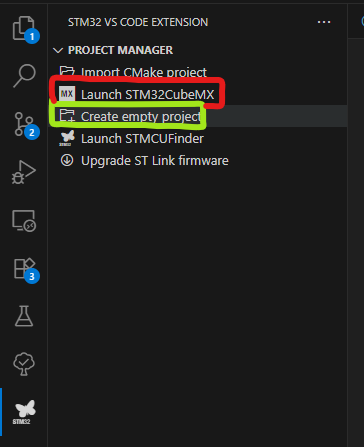
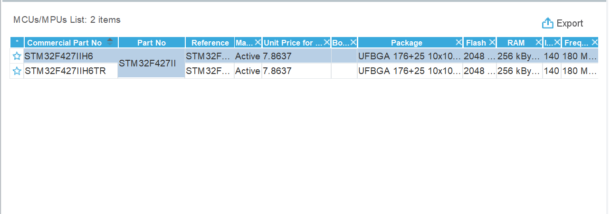
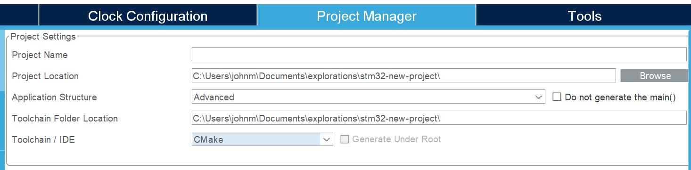
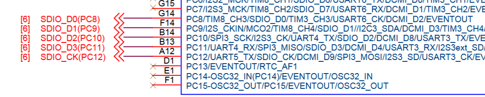
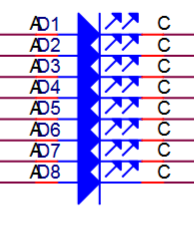
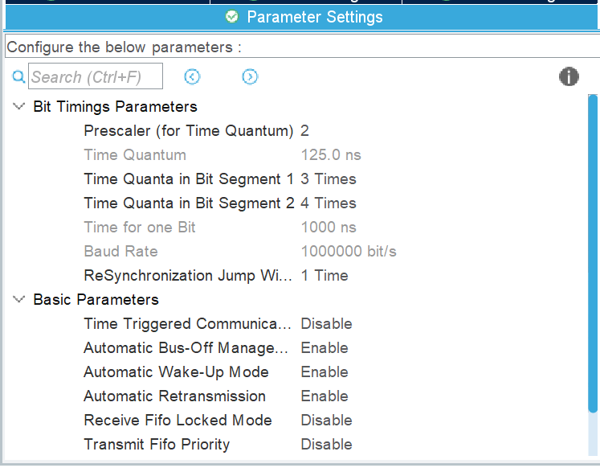
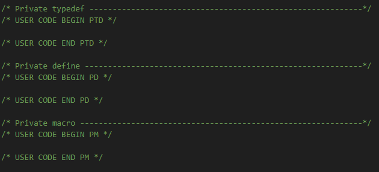

# Embedded Onboarding Project #1
This project is focused on introducing basic features of tools like STM32Cube for VSCode's extension, and CubeMX as well as introducing new concepts like Hardware Abstraction Layer (HAL), CANBUS, and GPIO. If you haven't already, please read through `README.md` before beginning the project. 

## Project Description
You will be making project for communicating payloads over a multi-node network using CANBUS. The network will consist of three Robomaster Type-A development boards connected onto the same CAN bus. The code on each board should be essentially identical except for some minor changes to some constants (i.e. only 1-2 lines of code should be different between the code flashed onto each Type-A board). Each board should be sending a packet with a unique load (a number) onto the bus for the other boards to receive and display on a LED array in binary.

## Project Creation
There are two ways to create a project: with CubeMX or without CubeMX. Without CubeMX, you will not generate a ioc file for the project which is important for using CubeMX's code generation capabilities. Without CubeMX, you will have to manually program the instructions for initializing and configuring each peripheral yourself instead of using a GUI app and letting it generate the relevant code for you. This is not recommended, but, if you want to do this, select "Create empty project" highlighed in green. Otherwise, launch CubeMX (highlighed in red).



Afterwards, select `File > New Project` which will begin by asking you to select a MCU/MPU. For the DJI Robomaster Type-A boards, enter "STM32F427IIH6" into the `Commercial Part Number` search bar and select it in the `MCUs/MPUs` list before clicking `Start Project`



After starting the project, CubeMX will bring you to the main configuration page. You will spend most of your time on `Pinout & Configuration`, however, for project creation goto `Project Manager` and fill in `Project Name`, `Project Location`, and set `Toolchain/IDE` to `CMake`.



Afterwards, you can `Generate Code` and it will generate relevant boilerplate for you in the file location you specified under `Project Location`. Then, import the project using `Import CMake project` back in VSCode, it should auto-fill most of the fields if you select the correct directory (the directory should contain the project's .ioc file).

I will not be describing how to use CubeMX, there are much better resources elsewhere that can help you with that. One of them is the [CubeMX User Manual from STM32 themselves](resources/CubeMX-User-Manual.pdf) which includes tutorials and a fairly in depth describing about the tool. If you are interested in using the manual, I think `STM32CubeMX user interface > Pinout & Configuration View` and `11 Tutorial 1: ...` sections will be the most helpful. Although, feel free to read more!

## MCU Pinout Configuration
You'll need to configure `CAN1` and some GPIO pins connected to LEDs on the development board for the project. For this, the [Dev-A Schematic will be helpful](resources/Dev-A-Schematic.pdf), which shows the electrical system on the board. We are only interested in which pins are connected to the 8 LED array and the pins for `CAN1`.



Here is a snippet from the schematic. You can see that `SDIO_D0` - `SDIO_D3` are connected to pins `PC8` - `PC11` respectively. From the blue text, you can also see what other purposes those pins can be used for. For example, `PC8` can also be configured to `DCMI_D2` or `TIM8_CH3`, etc. however, it can only be configured to one of them at a time (i.e. it `PC8` cannot be used for `SDIO_D0` and `DCMI_D2` at the same time). This does not mean we have access to all the functionality of those pins, we can only use the one that is electrically connected on board (e.g. we can't actually use `DCMI` even if we configure the pins because its not supported by the board). Some pins are not connected to anything, and thus cannot be used for anything (e.g. `PC13` shows a connection to an `x` which means it's NC or "no connection").

For LED array, look for pins connected to light-emitting diodes in the schematic (included below). They are grouped together, so once you found one you'll find all of them. Once you've identified the pins set all of them to `GPIO_Output` in CubeMX (there should be 8 LEDs in total).



CubeMX will sometimes misconfigure the pins when you enable something using the categories menu, this happens with `CAN1`. After enabling `CAN1`, use the schematic and change to the correct pins. Look for pins connected to `CAN1_RX` and `CAN1_TX`. Additionally, set the `GPIO Pull-up/Pull-down` for `CAN1_RX` to `Pull-up` and set these parameter settings.



You may mess with the bit timings parameters if you want. The only important thing is that the `Baud rate` is the same for all nodes on the CAN bus. I am also giving you the `Basic Parameters` for the bus because configuring CAN is a little finicky and not the point of this project. If you want a really in depth description of CAN on the MCU, [check out Controller area network (bxCAN) in the reference manual](resources/STM32F427xx-Reference-Manual.pdf).

## Coding and HAL
CubeMX generates a boilerplate project with lots of firmware code included. Your code will be in `main.c`. In the file you'll see a lot of comments, some of these specify safe zones to put your code in where it will not be overwritten by CubeMX the next time it generates code for you.



Here the region between "USER CODE BEGIN PTD" "USER CODE END PTD" is safe for writing your code. The same goes for private defines and macros sections. The section names are only suggestions, they don't restrict what kind of code you can put in there (e.g. you can put macros in private variables section). 

We will be using whats called a Hardware Abstraction Layer (HAL) to more easily program the MCU. HAL is a collection of software libraries that implements common methods so we don't have to mess around with registers. You'll be interested in the [`HAL CAN Generic Driver` and `HAL GPIO Generic Driver` sections in the HAL reference](resources/UM1725-STMF4-HAL-LL.pdf). The LEDs are turned on/off using the GPIO functions. CAN1 is programmed through the CAN HAL library. The CAN library requires some additional setup which you can find instructions about in the `How to use this driver` section. One of these steps is configuring the hardware message filter which you can do with the below code.

```c++
CAN_FilterTypeDef CAN_FilterConfigStructure;
CAN_FilterConfigStructure.FilterIdHigh = 0x0000;
CAN_FilterConfigStructure.FilterIdLow = 0x0000;
CAN_FilterConfigStructure.FilterMaskIdHigh = 0x0000;
CAN_FilterConfigStructure.FilterMaskIdLow = 0x0000;
CAN_FilterConfigStructure.FilterFIFOAssignment = CAN_FILTER_FIFO0;
CAN_FilterConfigStructure.FilterMode = CAN_FILTERMODE_IDMASK;
CAN_FilterConfigStructure.FilterScale = CAN_FILTERSCALE_16BIT;
CAN_FilterConfigStructure.FilterActivation = ENABLE;
CAN_FilterConfigStructure.FilterBank = 0;

HAL_CAN_ConfigFilter(&hcan1, &CAN_FilterConfigStructure);
```

Again, configuring the filter is not the point of this project, but if you want to know more [look into bxCAN functional description > Identifier filter under the bxCAN section](resources/STM32F427xx-Reference-Manual.pdf).

There are two different ways to get messages from CAN: polling or interrupt. The demo uses interrupts which may be more complicated then polling, however, it may be benefitical to learn about interrupts early on as they are quite useful compared to polling. The choice of how to get messages is up to you.

## Hints
Comming soon.