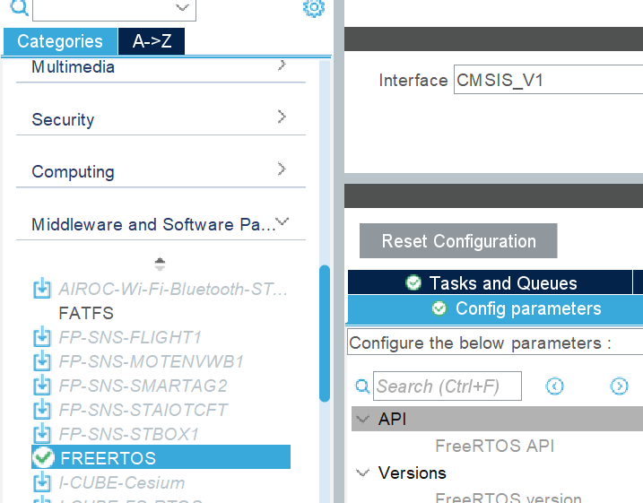
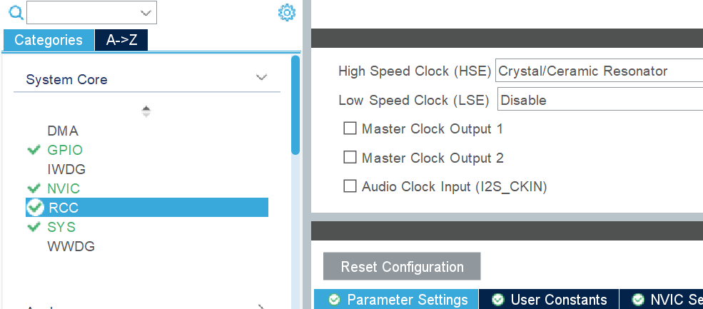
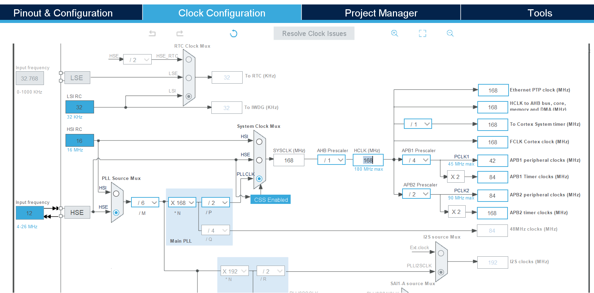
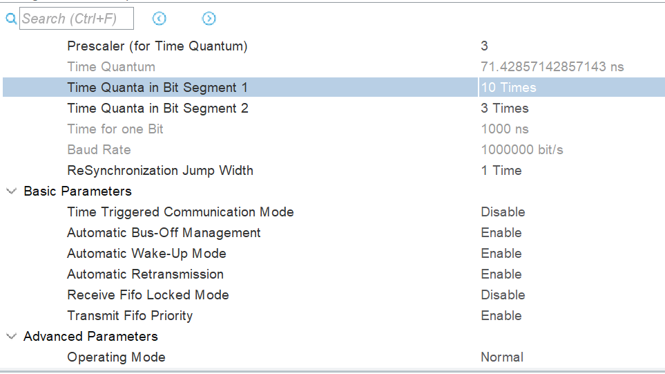

# Embedded Onboarding Project #2
This project is focused on introducing the basics of PID control, GM6020 motor, and FreeRTOS programming. Knowledge from Embedded Onboarding 1 is applicable to this project so it is a good idea to have completed that project before proceeding with this one. Concepts like project creation, HAL, etc. will not be reviewed or covered in this project.

## Project Description 
You will be creating FreeRTOS tasks, establishing inter-task communication, parsing feedback frames and sending command frames to GM6020 via CAN. All of these concepts are used in the operation of embedded systems on our robots and it is important to understand them if you intend to contribute to our main codebase. 

Real-time operating systems are commonly used in embedded systems to handle the complexity of multiple demands that these systems must meet. For example, on the Gimbal board on our robots, the board has to process sensor data from multiple different sensors (e.g. IMU, motor encoders, chassis data, etc.), process them, calculate command signals to send to actuators, and send them all at the same time. Implementing a system that handles all of these at virtually the same time is difficult so RTOS's are used to help simply the system in exchange for some trade offs.

For this project, create two RTOS tasks: one for commanding the motor, and another one for running the control system for it. Please use message passing with FreeRTOS queues for communicating data between tasks and other tasks, and ISRs. A shared memory model for communication can be used, however, this is not used on the robots and you'll have to learn about synchronization primitives like mutexes and semaphores instead of queues. For the motor control system, I advise using a simple PID controller as these are easy to implement and can be tuned without extensive knowledge of system dynamics. PID controllers are used extensively on the robots for motion control and are generally quite varsatile for controlling many different systems.

<video controls>
  <source src="figures/embedded_onboarding_2_demo.mp4" type="video/mp4">
</video>

The above video is a demonstration of the desired end behavior. A development Type-A board is reading feedback from the GM6020 motor over CANBUS, calculating an appropriate control signal using a PID controller, and sending the signal to the motor. One of the two tasks is sending position commands for the control task to set the motor to. The position commands start from 0 and goto 210 in increments of 30 degrees before wrapping back to 0. You can see the position command displayed on LEDs on the board (there is an intentional small delay between displaying a new position command and the command being sent to the control task for this demonstration).

## Configuration
Configuration is a not a primary focus of this project, so below are some recommended settings. 

### Enabling FreeRTOS

CubeMX allows you to easily add FreeRTOS to any project by enabling it under `Middleware and Software Packs` section. Please select `CMSIS_V1` as the interface when you enable FreeRTOS.

[CMSIS](https://www.arm.com/technologies/cmsis) is a standard that FreeRTOS has support for that defines an interface of methods that have to be implemented for software to meet the standard. Using this interface is meant to encourage code reuse and reduce development time between different embedded systems projects. Essentially, this means there an extra set of functions that wrap FreeRTOS functions that you can use. If you choose to use the [CMSIS methods](https://arm-software.github.io/CMSIS_5/RTOS/html/index.html), please make sure you know what their [FreeRTOS equivalents](https://www.freertos.org/Documentation/02-Kernel/04-API-references/01-Task-creation/00-TaskHandle) are.

### Clock Configuration for CAN
The GM6020 has some finicky CANBUS timings that you have to meet otherwise the motor will not recognize your commands and you will not be able to receive feedback from it either. First, enable the Crystal Resonator for a High Speed Clock under RCC in the Pinout & Configuration Tab.

Afterwards, goto Clock Configuration Tab and set the Input Frequency to 12 and enable CSS. Next, set `HCLK` to 168 and hit `Enter`. An auto-solver should run to create a valid clock configuration for using the parameters you've set.

Finally, set the following parameters for the `CAN1` (make sure that your GPIO pins are correct).

## Coding and Resources
The feedback and command frame formats are outlined in the [User Manual](resources/GM6020-User-Guide.pdf) as well as general operation of the motor. 

> Beware of the motor ID and the controllable command voltage range when you are controlling the motor. These are important to be aware of when interacting with these motors.

The demo follows the following structure:
 - 2 FreeRTOS tasks (one control task and one command task).
 - 1 ISR (for when there are pending messages from CAN).
 - 2 FreeRTOS queues (one for command messages from command task to control task and one for feedback messages from ISR to control task).

You do not have to follow this structure when completing this project, however, if you do do something different, please try to use FreeRTOS functionality.

There is more coding involved in this project than `Embedded Onboarding 1`, so multiple source files and header files are encouraged. Splitting up your code into different files helps with organization and is considered best practice. User created files are not tampered with but CubeMX during code generation, so you do not have to worry about code disappearing within those files. If you do create more files, you will have to modify the project's `CMakeLists.txt` file to build them into the executeable. There is a [tutorial](https://cmake.org/cmake/help/latest/guide/tutorial/index.html) on the official CMake website that you could follow. You only really need to understand the basics: creating libraries, different library types, how to link libraries, and including include directories.

### Creating the Motor Control System
Control theory is a vast field, but for this project we only need to a simple position controller for our motor so PID will be sufficient. There is an excellent [video lecture series by Christopher Lum](https://youtu.be/_VzHpLjKeZ8?si=JXmwMpWzgg_doy8_) that talks about Control Theory if you are interested. [Matlab](https://youtu.be/wkfEZmsQqiA?si=tgFkDFmU473ycKvJ) also has a shorter introduction to PID control that may be helpful. Even though PID control is relatively simple, there is a lot you can learn about it and a lot you can use it for. You do not need to do any modelling or analysis for this project (you can if you want though!), simply implementing and tuning a basic controller is sufficient.

After you have implemented the controller, I suggest installing CubeIDE and learning how to use `Live Expressions` to tune the gains on your controller. CubeIDE makes it much easier to tune controllers since you can change the gains while the controller is running instead of having to change it in code and reflash every time.